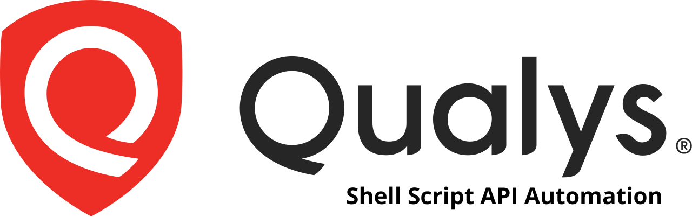
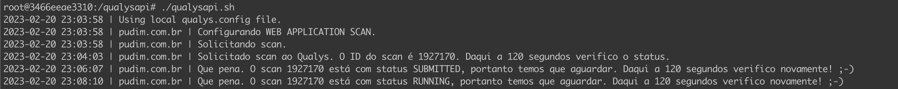
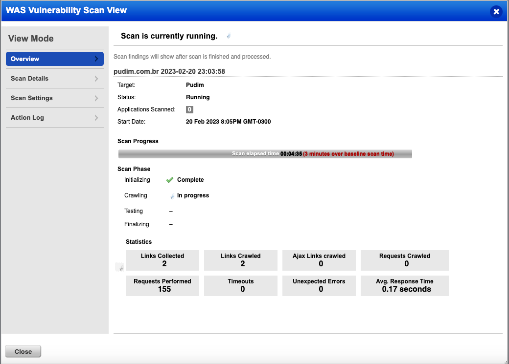
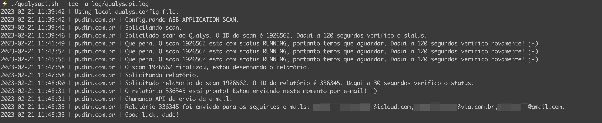
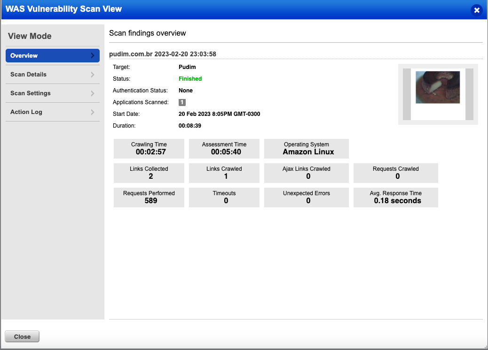
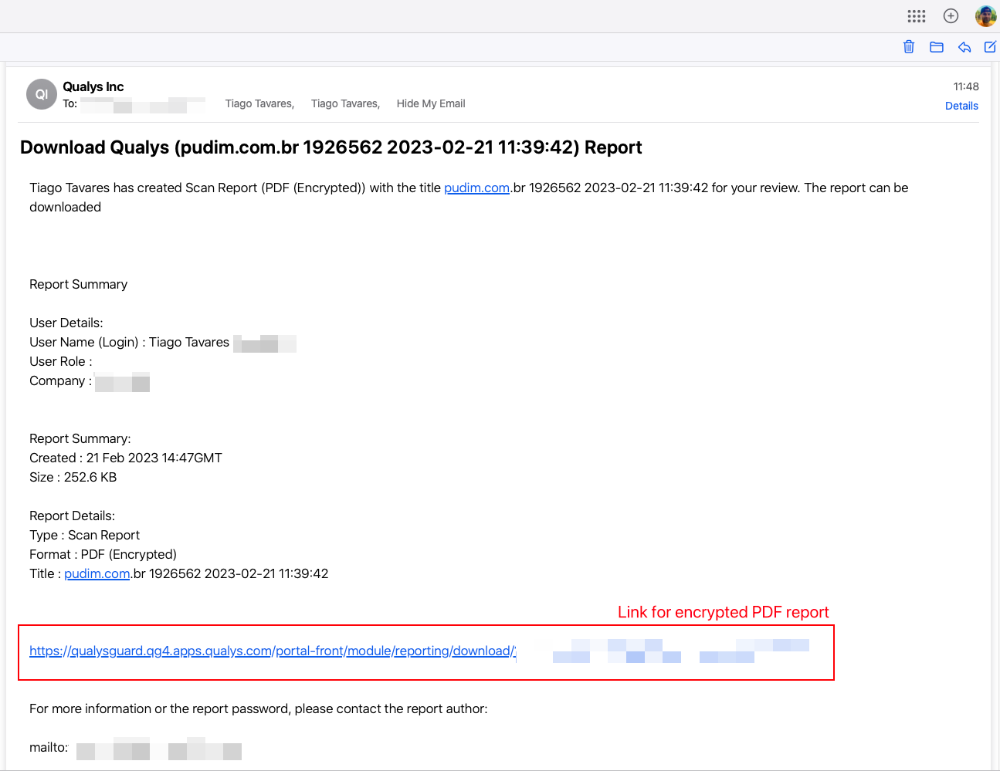

- [Introduction](#introduction)
- [Notice of Non-Affiliation and Disclaimer](#notice-of-non-affiliation-and-disclaimer)
- [Features](#features)
- [Configuration](#configuration)
  - [Configure you Application in Qualys Cloud Platform](#configure-you-application-in-qualys-cloud-platform)
  - [Choose your environment](#choose-your-environment)
    - [Running  Locally](#running--locally)
    - [Running in Github Actions Runners](#running-in-github-actions-runners)
- [References](#references)

# Introduction

This is a very simple shell script tool created years ago internally in my last job after the advent of digital transformation era (Agile and DevOps) in Brazil 🇧🇷.  This is now available after start conducting new tests for my current employer.

I don't aim to make things more complex, the goal is to make everything functional and easy to use in daily basis. I woud love to receive your help for bug fixes and improments. ☺️


# Notice of Non-Affiliation and Disclaimer

We are not affiliated, associated, authorized, endorsed by, or in any way officially connected with  Qualys, Inc., or any of its subsidiaries or its affiliates. The official Qualys website can be found at www.qualys.com. 

Qualys and the Qualys logo are registered trademarks of Qualys, Inc. All other trademarks are the property of their respective owners.


# Features

Find bellow the features already available and that we will develop in the future.

- **Application Security**
  - [x] Qualys Web Application Scanning


- **Infrastructure Security**
  - [ ] *Qualys VMDR (In the future)*


- **CI/DC**

  - [x] Github Actions (Native)

  - [ ] CI/CD gate support


- **Other**

  - [x] Build reports through Qualys API

  - [x] Send reports through Qualys API

  - [ ] Dockerfile

  - [ ] Push vulnerabilies to DefectDojo
    - [ ] Messaging
      - [ ] Microsoft Teams
      - [ ] Slack
      - [ ] E-mail


  - [x] Secrets
    - [x] Github Secrets
    - [ ] Delinea DevOps Secrets Vault
    - [ ] Azure Key Vault
    


# Configuration

## 1) Configure you Application in Qualys Cloud Platform

Just follow the instructions availaibe at your Qualys WAS dashboard or [Qualys WAS Getting Started Guide](https://www.qualys.com/docs/qualys-was-getting-started-guide.pdf) and start your scans with the configurations you need. After that you'll have all information needed for the following steps.

## 2) Choose your environment

⚠️ All steps bellow were tested in **Ubuntu 20.04/22.04**.  

### Running  Locally

1. Setup environment. Let's make sure everything will work properly.
   ```bash
   # Update and install possible dependencies or tools to make your life easier
   sudo apt update
   
   sudo apt install -y sudo net-tools wget git curl p7zip-full ca-certificates apt-transport-https \
   software-properties-common pssh python3 python3-pip python-setuptools vim nano timedatectl
   
   # Setup your timezone for logs and reports info with correct time.
   # List all timezone and choose yours
   timedatectl list-timezones
   
   #Setup chosen timezone
   sudo timedatectl set-timezone America/Sao_Paulo
   ```

2. Clone this repository

   `git clone https://github.com/0xtiago/qualysapi`

3. Enter the repository and rename `qualys_sample.config` to `qualys.config`.

4. Setup `qualys.config` with the information you have configured and taken from Qualys in the Step 1.

   ```bash
   # QUALYS_LAUNCH_MODE
   ## 1 - Get secrets and variables from this file
   ## 2 - Get secrets and variables from Github Environments configuration
   ## 3 - Get secrets and variables from Delinea DevOps Secrets Vault
   QUALYS_LAUNCH_MODE=1
   
   QUALYS_SCANNER_TYPE='EXTERNAL'
   
   QUALYS_URL='https://qualysapi.qualys.com'
   QUALYS_USER='your Qualys user'  
   QUALYS_USER_PASS='your Qualys password'
   
   QUALYS_PROJECT_NAME='Project name'
   QUALYS_WEBAPP_ID='The app ID nmber' 
   QUALYS_OPTION_PROFILE_ID='The option profile number'
   
   QUALYS_SEND_REPORT=1
   QUALYS_ENCRYPT_REPORT=1
   QUALYS_REPORT_PASS='The password of the reports. Left blank if you dont want to protect it. ;)'
   QUALYS_REPORT_RECEIVERS="email1@gmail.com, email2@hotmail.com, email3@yahoo.com"
   ```

4. Give execution permission and execute the script.
   ```bash
   chmod +x qualysapi.sh
   
   ./qualysapi.sh
   ```

5. Script launched Qualys scan execution and waiting for its finishing. 
   

   In Qualys WAS dashboard you can see the vulnerability scan running after API request.

   

   By the end of scanning, the output of the script will be like this, and triggering Qualys to send the report for the configured email.
   
   In Qualys platform, we can also see its status.

   
   All the e-mails receivers in the list will get an e-mail like this with the link to download the encrypted PDF.
   


### Running in Github Actions Runners

Atenção, runner permanece ativo por 360 minutos (6 horas), entao é necessario ajustar no QUalys o tempo maximo de scan.


```
od -An -N1 -i /dev/random > examples/apps/vulnerable-node-app/trigger.txt
```


# References

- [Qualys Web Application Scanning API Documentation](https://www.qualys.com/docs/qualys-was-api-user-guide.pdf)
- [Qualys WAS Getting Started Guide](https://www.qualys.com/docs/qualys-was-getting-started-guide.pdf)


Support this cause.

[](https://www.buymeacoffee.com/tiagotavares)
