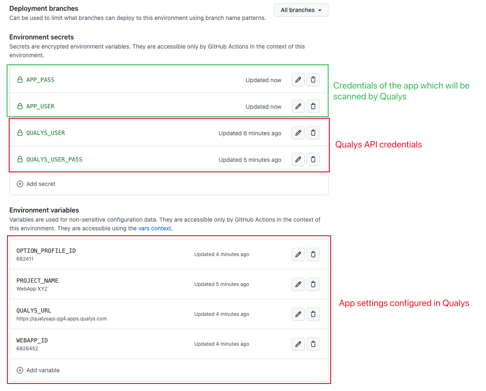

# qualysapi

This is a very simple script created years ago internally in my last job after the advent of digital transformation era. 
It keeps simple, but with some small improvements and made available to the community.

# Configuration

1. Rename `qualys_sample.config` to `qualys.config`;
2. 

`./qualysapi.sh | tee -a log/qualysapi.log` 

# Github Actions

## Secrets 

- APP_PASS
- APP_USER
- QUALYS_USER
- QUALYS_PASS

- OPTION_PROFILE_ID
- PROJECT_NAME
- QUALYS_URL
- WEBAPP_ID

